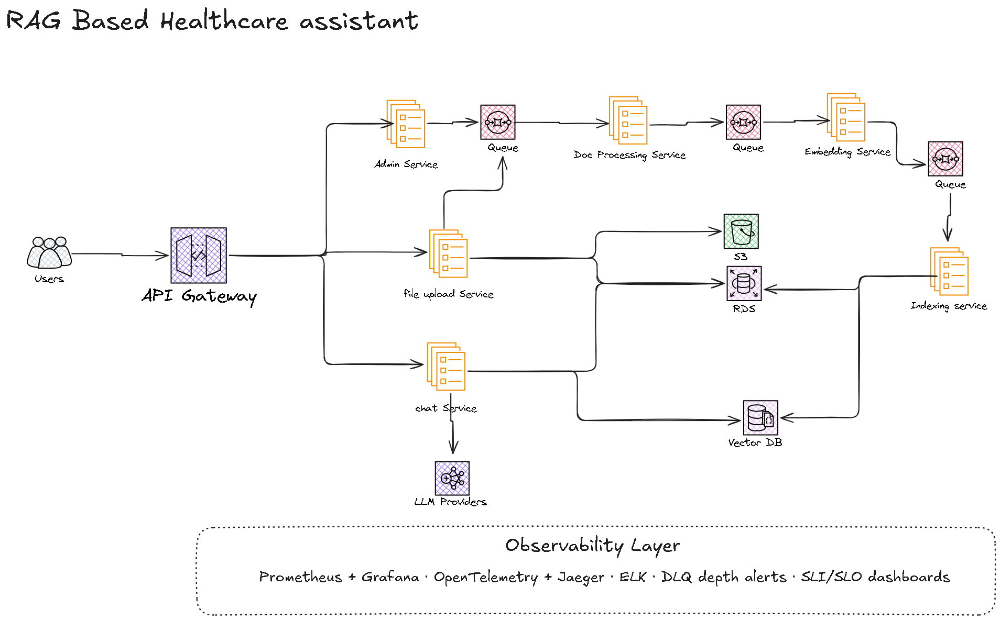

# RAG Healthcare Knowledge Assistant

An internal AI assistant for healthcare teams. Staff ask natural-language medical questions and get accurate, source-cited answers drawn from the organisation's own clinical document library — clinical guidelines, hospital policies, HL7 standards, drug formularies.

Built on a HIPAA-compliant microservices architecture with a 3-stage async document processing pipeline, hybrid semantic + keyword retrieval, and zero-downtime re-indexing.

---

## Architecture



> Full architecture walkthrough → **[ARCHITECTURE.md](ARCHITECTURE.md)**

The system is composed of 6 microservices behind an AWS API Gateway:

| Service | Role |
|---|---|
| **Chat Service** | Query expansion → hybrid search → rerank → LLM → SSE stream |
| **Uploader Service** | Receive file → S3 → PostgreSQL → enqueue |
| **Doc Processing** | PII scrub → parse → chunk → enqueue |
| **Embedding Service** | OpenAI text-embedding-3-large (3072-dim) → enqueue |
| **Indexing Service** | Write vectors to Weaviate → update status → audit log |
| **Admin Service** | Re-index, alias swap, DLQ management, health checks |

Services communicate through **AWS SQS queues** (3 queues + 3 Dead Letter Queues). No service waits on another — each finishes its job and pushes to the next queue.

---

## System Design Docs

| Document | Contents |
|---|---|
| [ARCHITECTURE.md](ARCHITECTURE.md) | Full design: services, async pipeline, LLM strategy, scaling, failure recovery, tech stack |
| [Architecture Overview](specs/architecture/overview.md) | Component diagram, data stores, re-index flow, ADR index |
| [Data Model](specs/architecture/data-model.md) | PostgreSQL schema (documents, query_history, indexing_jobs, chunk_audit), Weaviate class, S3 layout |
| [API Reference](specs/architecture/api-reference.md) | All endpoints with request/response examples, SQS message schemas, rate limits |
| [OpenAPI Spec](specs/architecture/openapi.yaml) | Formal OpenAPI 3.0.3 spec — importable into Swagger UI or Postman |
| [Services Breakdown](specs/architecture/services.md) | Per-service responsibilities, triggers, scaling rules |

---

## Architecture Decisions (ADRs)

| ADR | Decision |
|---|---|
| [0001](specs/decisions/0001-microservices-over-monolith.md) | Microservices — one job per service |
| [0002](specs/decisions/0002-sqs-async-pipeline.md) | SQS async pipeline with DLQs |
| [0003](specs/decisions/0003-medical-embedding-models.md) | BioGPT/SciBERT for medical embeddings (superseded by 0003a) |
| [0003a](specs/decisions/0003a-biomedbert-hf-inference-api.md) | OpenAI text-embedding-3-large replaces BiomedBERT (not production-ready) |
| [0004](specs/decisions/0004-zero-downtime-reindex.md) | Shadow index + alias swap |
| [0005](specs/decisions/0005-ecs-fargate-over-eks.md) | ECS Fargate over EKS |
| [0006](specs/decisions/0006-vector-db-weaviate.md) | Weaviate as vector DB (hybrid search + alias swap) |
| [0007](specs/decisions/0007-fastapi-backend-framework.md) | FastAPI for all HTTP-facing services |

Full ADR index → [specs/decisions/README.md](specs/decisions/README.md)

---

## Tech Stack

| Layer | Technology | Why |
|---|---|---|
| API Gateway | AWS API Gateway | Managed JWT auth, rate limiting, routing |
| Backend | Python FastAPI | Async-native, SSE streaming, ML ecosystem |
| RAG | LangChain | Retrieval chains, prompt management |
| LLM (primary) | GPT-4 / Claude 3 | Best quality for medical queries |
| LLM (fallback) | Anthropic Claude (claude-sonnet-4-6) | API-based fallback; self-hosted Ollama planned for Phase 3 |
| Embeddings | OpenAI text-embedding-3-large | 3072-dim; GPU-swappable via `EMBEDDING_PROVIDER` env var |
| Vector DB | Weaviate | Hybrid semantic + keyword (BM25) search |
| SQL DB | PostgreSQL (RDS Multi-AZ) | Audit logs, doc status, query history |
| Queues | AWS SQS | Managed, DLQ built-in, drives autoscaling |
| Storage | AWS S3 | Raw docs, lifecycle → Glacier after 90 days |
| Compute | ECS Fargate + EC2 GPU | Serverless containers + GPU for embeddings |
| CI/CD | GitHub Actions | Test, build, deploy |
| Observability | Prometheus + Grafana, Jaeger, ELK | Metrics, tracing, logs |

---

## Data Flow

**Document ingestion**
```
User uploads file
  → Uploader Service (S3 + PostgreSQL + SQS 1)
  → Doc Processing (PII scrub → chunk → SQS 2)
  → Embedding Service (text-embedding-3-large → SQS 3)
  → Indexing Service (write to Weaviate + audit log)
```

**Query response**
```
User asks question
  → Chat Service (query expand → hybrid search Weaviate → rerank)
  → LLM Router (GPT-4/Claude → Llama fallback)
  → SSE stream back to user with source citations
  → Audit log written to PostgreSQL
```

---

## Performance Targets

| Metric | Target |
|---|---|
| p95 response time | < 2 seconds |
| Concurrent users | 500+ |
| Document throughput | 1000+ docs/min during re-index |
| Uptime | 99.9% |
| Re-index downtime | Zero |

---

## Project Planning

| Document | Contents |
|---|---|
| [Summary](SUMMARY.md) | 1-page overview — architecture, design decisions, how to run |
| [Roadmap](specs/planning/roadmap.md) | 6-phase release plan (v0.1 → v1.0) |
| [Status](specs/status.md) | Current phase, progress, blockers |
| [Backlog](specs/backlog/backlog.md) | Features, bugs, tech debt |

---

## Quick Start

### Prerequisites

- [Docker](https://docs.docker.com/get-docker/) 24+ with Docker Compose v2
- An OpenAI API key — **or** use mock mode (see below) to run without one

### 1. Configure environment

```bash
cp .env.example .env
```

Open `.env` and fill in your API keys:

```
OPENAI_API_KEY=sk-...        # for embeddings + LLM
ANTHROPIC_API_KEY=sk-ant-... # for LLM fallback
```

**No API key? Use mock mode.** Uncomment these three lines in `.env` to run the full ingest + search pipeline locally with placeholder LLM responses — no external calls made:

```
EMBEDDING_PROVIDER=mock
LLM_PRIMARY=mock
LLM_FALLBACK=mock
```

### 2. Start all services

The docker-compose file lives under `infrastructure/docker/`. Run from the repo root:

```bash
docker compose -f infrastructure/docker/docker-compose.yml up --build
```

This starts 8 application services plus PostgreSQL, Weaviate, ElasticMQ (SQS), and MinIO (S3). Database migrations and Weaviate schema initialisation run automatically on first boot.

### 3. Verify everything is up

```bash
# All six services should return HTTP 200
curl http://localhost:8001/health   # chat-service
curl http://localhost:8002/health   # uploader-service
curl http://localhost:8006/api/v1/health  # admin-service
```

### Service ports

| Service | Local port |
|---|---|
| Chat Service | `8001` |
| Uploader Service | `8002` |
| Admin Service | `8006` |
| Weaviate | `8080` |
| Adminer (DB UI) | `8081` |
| PostgreSQL | `5432` |
| ElasticMQ (SQS) | `9324` |
| MinIO (S3) | `9000` / `9001` (console) |

### 4. Upload a document

```bash
curl -X POST http://localhost:8002/api/v1/knowledge/ingest \
  -F "file=@/path/to/your/document.pdf" \
  -F "title=My Document" \
  -F "doc_type=clinical_guideline"
```

The document flows through the async pipeline automatically:
`Uploader → Doc Processing → Embedding → Indexing → Weaviate`

### 5. Ask a question

```bash
curl -X POST http://localhost:8001/api/v1/knowledge/ask \
  -H "Content-Type: application/json" \
  -d '{"question": "What is the protocol for patient discharge?", "user_id": "usr_001", "session_id": "sess_001"}'
```

### 6. Trigger a re-index (optional)

Forces all documents to be re-embedded and re-indexed into a shadow index, then swaps the alias atomically when complete:

```bash
curl -X POST http://localhost:8006/api/v1/admin/reindex \
  -H "Content-Type: application/json" \
  -d '{"reason": "embedding model upgrade"}'
```

> API reference → [specs/architecture/api-reference.md](specs/architecture/api-reference.md)  
> OpenAPI spec → [specs/architecture/openapi.yaml](specs/architecture/openapi.yaml)
